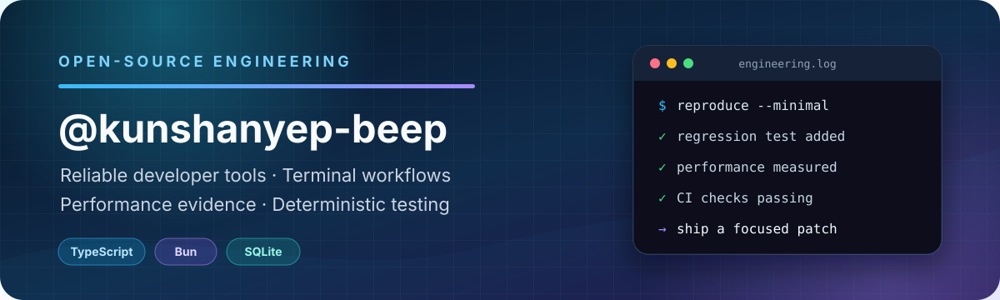

  

  
  
  

## About me

I am an open-source contributor focused on reliable developer tools, terminal workflows, and performance-sensitive systems.

- I turn reproducible problems into focused patches, regression tests, and measurable results.
- I contribute to [deepcoldy/botmux](https://github.com/deepcoldy/botmux), improving terminal input, Lark interactions, dashboard ergonomics, and CI reliability.
- I care about deterministic tests, narrow interfaces, safe fallbacks, and performance evidence.

## Open-source impact

Contributions to [botmux](https://github.com/deepcoldy/botmux): **4 merged PRs · 4 open PRs**. Status verified on September 21, 2026.

| Status | Contribution | Engineering result |
| :---: | --- | --- |
| **Merged** | [botmux #1419 — fail closed without requester identity](https://github.com/deepcoldy/botmux/pull/1419) | Prevented requester-only feedback on cards with no stored requester identity; added a regression test that checks no feedback revision is written. All CI checks passed. |
| **Merged** | [botmux #1312 — add paste protocol support to bare PTY input](https://github.com/deepcoldy/botmux/pull/1312) | Added bracketed-paste handling for long or multiline OpenCode V2 messages on raw PTY while preserving typing behavior for slash commands and short single-line input. |
| **Merged** | [botmux #1314 — optimize TraeX session-recovery lookup](https://github.com/deepcoldy/botmux/pull/1314) | Replaced full-tree recursion with a SQLite-indexed fast path, depth-bounded date traversal, and bounded miss backoff. In a deterministic 200-sidecar fallback fixture, stat calls fell from 204 to 0 with at most 4 directory reads. |
| **Merged** | [botmux #1293 — eliminate a history-ownership test timing race](https://github.com/deepcoldy/botmux/pull/1293) | Replaced fixed-delay test orchestration with an Enter-event happens-before boundary, preserving ownership filtering and retry coverage. |
| **Open · awaiting review** | [botmux #1498 — remove a statusline watchdog CI timing flake](https://github.com/deepcoldy/botmux/pull/1498) | Separated a real watchdog failure from CI scheduling overhead, raised the test-only outer bound from 12s to 15s without changing the production 10s watchdog or 1s kill grace, and verified the boundary under 12-way parallel load. All CI checks passed. |
| **Open · awaiting review** | [botmux #1496 — restore scrolling in the add-bot model picker](https://github.com/deepcoldy/botmux/pull/1496) | Scoped the fix to one onboarding dropdown CSS override so wheel gestures can chain back to the outer form when the model list has no scroll range. Reproduced with Playwright. |
| **Open · awaiting review** | [botmux #1418 — reject stale feedback card callbacks](https://github.com/deepcoldy/botmux/pull/1418) | Added card version checks inside the SQLite write transaction so delayed callbacks cannot restore an older feedback choice or repaint the card. |
| **Open · awaiting review** | [botmux #1417 — serialize live card toggle updates](https://github.com/deepcoldy/botmux/pull/1417) | Routed live-card toggle updates through the existing patch queue to prevent an older in-flight update from restoring stale display state. |

## Toolbox

  
  
  
  
  
  

## GitHub activity

<picture>
  <source media="(prefers-color-scheme: dark)" srcset="https://raw.githubusercontent.com/kunshanyep-beep/kunshanyep-beep/main/profile-summary-card-output/github_dark/0-profile-details.svg" />
  <source media="(prefers-color-scheme: light)" srcset="https://raw.githubusercontent.com/kunshanyep-beep/kunshanyep-beep/main/profile-summary-card-output/github/0-profile-details.svg" />
  
</picture>

  <picture>
    <source media="(prefers-color-scheme: dark)" srcset="https://raw.githubusercontent.com/kunshanyep-beep/kunshanyep-beep/main/profile-summary-card-output/github_dark/3-stats.svg" />
    <source media="(prefers-color-scheme: light)" srcset="https://raw.githubusercontent.com/kunshanyep-beep/kunshanyep-beep/main/profile-summary-card-output/github/3-stats.svg" />
    
  </picture>
  <picture>
    <source media="(prefers-color-scheme: dark)" srcset="https://raw.githubusercontent.com/kunshanyep-beep/kunshanyep-beep/main/profile-summary-card-output/github_dark/2-most-commit-language.svg" />
    <source media="(prefers-color-scheme: light)" srcset="https://raw.githubusercontent.com/kunshanyep-beep/kunshanyep-beep/main/profile-summary-card-output/github/2-most-commit-language.svg" />
    
  </picture>

## Contribution trail

<picture>
  <source media="(prefers-color-scheme: dark)" srcset="https://raw.githubusercontent.com/kunshanyep-beep/kunshanyep-beep/output/github-contribution-grid-snake-dark.svg" />
  <source media="(prefers-color-scheme: light)" srcset="https://raw.githubusercontent.com/kunshanyep-beep/kunshanyep-beep/output/github-contribution-grid-snake.svg" />
  
</picture>

  Profile statistics and contribution artwork refresh automatically every day.

